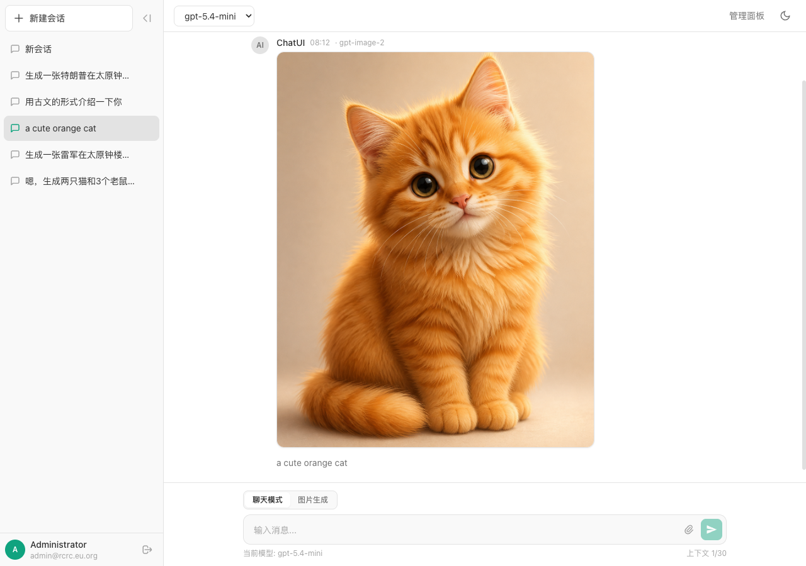
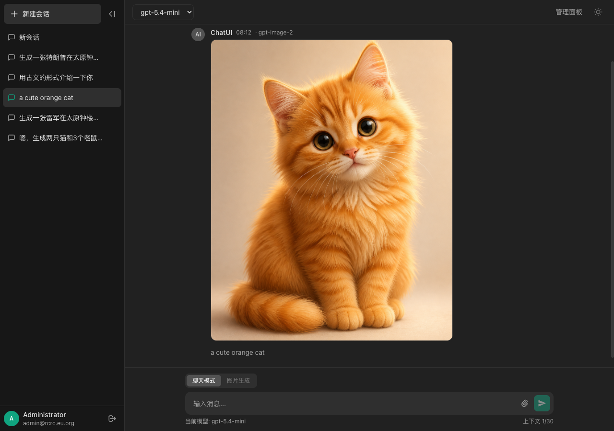
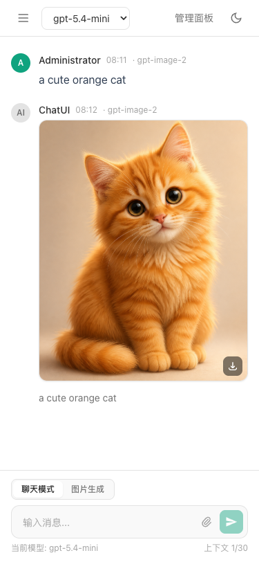

<div align="center">

# ChatUI

AI 聊天 Web 应用

文本对话 · 图片生成与编辑 · 文件上传

[](https://hub.docker.com/r/jiasongji/chatui)
[](https://hub.docker.com/r/jiasongji/chatui)
[](LICENSE)

[功能特性](#功能特性) · [快速部署](#快速部署) · [配置说明](#配置说明) · [注意事项](#注意事项) · [Docker Hub](https://hub.docker.com/r/jiasongji/chatui)

</div>

---

## 截图

<table>
<tr>
<td align="center">桌面端 · 亮色</td>
<td align="center">桌面端 · 暗色</td>
</tr>
<tr>
<td></td>
<td></td>
</tr>
</table>

<p align="center">
<br/>
<em>移动端 · 亮色</em>
</p>

## 功能特性

- **AI 对话** — 多模型文本对话，上下文记忆，Markdown 渲染 + 代码高亮
- **图片生成** — 支持 AI 图片生成，5 种宽高比可选（1:1 / 4:3 / 3:4 / 16:9 / 9:16）
- **图片编辑** — 上传图片，用 AI 修改图片内容
- **文件上传** — 对话中上传文件（代码、文档、图片，最多 5 个）
- **管理后台** — 用户管理、API 配置、邀请码管理
- **邀请码系统** — 批量生成邀请码，控制注册权限
- **用户审批** — 新注册用户需管理员审批后方可使用
- **加载体验** — 图片生成显示进度条和计时器，聊天显示打字动画
- **浏览器通知** — 任务完成后浏览器推送通知（切换标签页也不错过）
- **暗色/亮色主题** — 一键切换，自动跟随系统偏好
- **响应式设计** — 手机、平板、电脑完美适配
- **代码块下载** — AI 回复中的代码块可一键下载为文件

## 技术栈

| 组件 | 技术 |
|------|------|
| 框架 | Next.js 16（App Router，standalone 输出） |
| 数据库 | SQLite + Prisma ORM |
| AI 接口 | OpenAI 兼容 API（任意提供商） |
| 认证 | Session 认证 + bcryptjs 加密 |
| UI | Tailwind CSS 3 |
| 渲染 | react-markdown + remark-gfm + highlight.js |
| 部署 | Docker |

## 快速部署

### 一键部署（推荐）

```bash
mkdir chatui && cd chatui

# 下载部署文件
curl -O https://raw.githubusercontent.com/jiasongji/ChatUI/main/deploy/docker-compose.yml
curl -O https://raw.githubusercontent.com/jiasongji/ChatUI/main/deploy/.env.example
cp .env.example .env

# 修改配置（必填项）
# 编辑 .env：设置 SESSION_SECRET、ADMIN_EMAIL、ADMIN_PASSWORD、OPENAI_API_KEY
nano .env

# 启动
docker compose up -d
```

访问 `http://localhost:3000`，使用管理员账号登录。

### 从源码构建

```bash
git clone https://github.com/jiasongji/ChatUI.git
cd ChatUI
cp .env.example .env
# 编辑 .env
docker compose build && docker compose up -d
```

## 配置说明

### 必填环境变量

| 变量 | 说明 |
|------|------|
| `SESSION_SECRET` | Session 加密密钥（`openssl rand -hex 32` 生成） |
| `ADMIN_EMAIL` | 管理员邮箱（首次启动自动创建） |
| `ADMIN_PASSWORD` | 管理员密码 |
| `OPENAI_API_KEY` | OpenAI 兼容 API 密钥 |

### 可选环境变量

| 变量 | 默认值 | 说明 |
|------|--------|------|
| `OPENAI_BASE_URL` | `https://api.openai.com/v1` | API 接口地址 |
| `APP_URL` | `http://localhost:3000` | 应用公网地址 |
| `DEFAULT_CHAT_MODEL` | `gpt-5.4-mini` | 默认聊天模型 |
| `DEFAULT_IMAGE_MODEL` | `gpt-image-2` | 默认图片模型 |
| `ALLOWED_CHAT_MODELS` | `gpt-5.4-mini,gpt-5.4,gpt-5.5` | 可用聊天模型 |
| `ALLOWED_IMAGE_MODELS` | `gpt-image-2` | 可用图片模型 |
| `DATABASE_URL` | `file:/app/data/prod.db` | SQLite 数据库路径 |

### AI 接口兼容性

ChatUI 兼容所有 **OpenAI 格式 API**，修改 `OPENAI_BASE_URL` 即可接入：

| 提供商 | `OPENAI_BASE_URL` |
|--------|-------------------|
| OpenAI 官方 | `https://api.openai.com/v1` |
| Azure OpenAI | `https://<resource>.openai.azure.com/openai/deployments/<deployment>` |
| Ollama（本地） | `http://localhost:11434/v1` |
| 代理/自建服务 | 你的接口地址 |

## 项目结构

```
ChatUI/
├── app/
│   ├── api/            # API 路由（认证、聊天、图片、会话、管理）
│   ├── chat/           # 聊天界面（主界面）
│   ├── login/          # 登录页
│   ├── register/       # 注册页
│   └── admin/          # 管理后台（用户、邀请码、API 配置）
├── components/         # 共享组件
├── lib/                # 核心逻辑（openai、认证、模型、验证、prisma）
├── prisma/             # 数据库 Schema 和迁移
├── deploy/             # 通用部署模板
│   ├── docker-compose.yml
│   ├── .env.example
│   └── README.md
├── screenshots/        # 截图
├── Dockerfile
└── docker-compose.yml
```

## 注意事项

### Nginx 反向代理必须配置超时

AI 聊天的流式响应和图片生成耗时较长（图片生成通常 30-90 秒，复杂场景可达 5 分钟）。如果使用 Nginx 反向代理，**必须调大超时时间并关闭缓冲**，否则会频繁出现 502/504 错误：

```nginx
server {
    listen 443 ssl;
    server_name chat.example.com;

    ssl_certificate     /path/to/cert.pem;
    ssl_certificate_key /path/to/key.pem;

    location / {
        proxy_pass http://127.0.0.1:3000;
        proxy_set_header Host $host;
        proxy_set_header X-Real-IP $remote_addr;
        proxy_set_header X-Forwarded-For $proxy_add_x_forwarded_for;
        proxy_set_header X-Forwarded-Proto $scheme;

        # ⚠️ 这三项必须配置，否则图片生成和长对话会 502/504
        proxy_read_timeout 600s;    # 默认 60s，图片生成至少需要 300s
        proxy_send_timeout 600s;    # 发送超时同步调大
        proxy_buffering off;        # 关闭缓冲，否则流式响应会等待完毕才返回
    }
}
```

> **常见问题**：如果图片生成总是返回 502，99% 是 Nginx 的 `proxy_read_timeout` 太短，改为 `600s` 即可解决。

### 端口修改

默认映射到主机 3000 端口，可在 `docker-compose.yml` 中修改：

```yaml
ports:
  - "8080:3000"  # 改为 8080
```

### 数据备份与恢复

```bash
# 备份（数据库 + 所有上传文件）
tar czf chatui-backup-$(date +%F).tar.gz data/

# 恢复
tar xzf chatui-backup-2026-05-15.tar.gz
```

### 版本更新

```bash
docker compose pull && docker compose up -d
```

> 更新不会丢失数据，数据库和上传文件都挂载在 `./data/` 目录。

### Docker 网络配置

如果 AI API 也是 Docker 容器（如 CLIProxyAPI），可使用共享网络，通过容器名访问：

```yaml
# docker-compose.yml
services:
  chatui:
    image: jiasongji/chatui:latest
    environment:
      - OPENAI_BASE_URL=http://cliproxyapi:8317/v1  # 使用容器名
    networks:
      - ai-net

networks:
  ai-net:
    external: true
```

## 本地开发

```bash
npm install

# 初始化数据库
DATABASE_URL="file:./data/dev.db" npx prisma db push
DATABASE_URL="file:./data/dev.db" ADMIN_EMAIL="admin@test.com" ADMIN_PASSWORD="Admin123456" npx tsx prisma/seed.ts

# 启动开发服务器
DATABASE_URL="file:./data/dev.db" \
SESSION_SECRET="dev-secret-key-at-least-32-characters-long" \
OPENAI_API_KEY="sk-xxx" \
npm run dev
```

## 运维操作

```bash
# 查看日志
docker logs -f chatui

# 更新到最新版
docker compose pull && docker compose up -d

# 停止服务
docker compose down

# 备份数据
tar czf chatui-backup-$(date +%F).tar.gz data/

# 进入容器调试
docker exec -it chatui sh
```

## 数据持久化

所有数据存储在 `./data/` 目录：

```
data/
├── prod.db          # SQLite 数据库（用户、会话、消息）
└── uploads/         # 上传文件（图片、附件）
```

## 许可证

[MIT](LICENSE)
